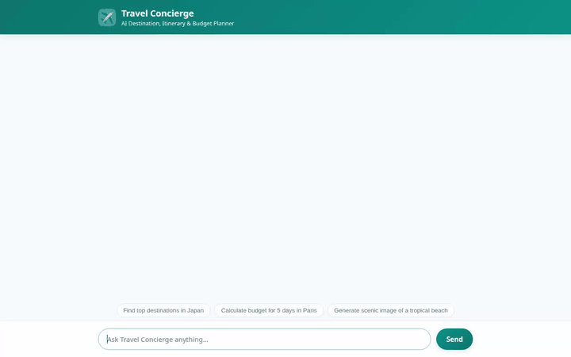

# Travel Concierge Agent

A conversational AI travel concierge built with the **Agent Development Kit (ADK)**, **Vertex AI**, and **Google Cloud Platform**. The agent helps travelers discover destinations, plan custom trip budgets, generate scenic photos & preview videos, track dietary restrictions and preferences, and view interactive recommendations using rich **A2UI** card layouts.



---

## Key Features & Capabilities

Based on the implementation in `app/agent.py` and `agents-cli-manifest.yaml`, the agent supports the following features:

- **Destination & Venue Search**: Searches and retrieves detailed travel venue recommendations and destination highlights stored in Google Cloud Firestore.
- **Dietary & Preference Memory Bank**: Automatically tracks and remembers user travel preferences, budget constraints, food allergies, and dietary restrictions across chat sessions to ensure all restaurant and itinerary recommendations comply with health needs.
- **Trip Cost Calculation & Currency Conversion**: Executes python calculations in the Agent Engine sandbox to compute itemized multi-day trip budgets, convert temperatures, and fetch live exchange rates.
- **AI Image Generation**: Generates scenic destination photographs using Vertex AI image generation models, displaying them via public Cloud Storage URLs and saving them to the ADK Playground Artifacts panel.
- **Omni Model Video Generation**: Creates short preview videos of travel destinations using Google's **Omni model** (`gemini-omni-flash-preview`) in the `global` region, uploading the MP4 video directly to Cloud Storage.
- **A2UI Rich UI Rendering**: Renders structured UI components (Cards, Columns, Rows, Text, and Images) dynamically in the frontend client.

---

## Google Cloud & ADK Integration

- **Google Cloud Firestore**: Backend NoSQL database for managing destination catalogs (`destinations` collection) and itinerary bookings.
- **Google Cloud Storage**: Public asset storage bucket (`travel-concierge-assets-qwiklabs-gcp-02-68959e46a2d9`) serving generated images and destination preview videos.
- **Vertex AI / Gemini API**:
  - `gemini-flash-latest`: Core conversational LLM for reasoning and A2UI card generation.
  - `gemini-3.1-flash-lite-image`: Multimodal image generation for travel destinations.
  - `gemini-omni-flash-preview` (Interactions API, `global` region): Generates high-fidelity MP4 destination videos.
- **ADK Sandbox (Code Executor)**: Isolated environment for calculating trip budgets and financial math.
- **ADK Memory Tools**: Persistent memory session tools (`preload_memory_tool`, `load_memory_tool`) for tracking user health requirements and preferences.

---

## Status of Features

| Feature | Status | Notes |
| :--- | :--- | :--- |
| Destination Catalog & Firestore Search | **Implemented** | Reads from Firestore `destinations` collection |
| User Allergy & Preference Memory Bank | **Implemented** | Session memory integration in ADK |
| Trip Budget Math & Currency Conversion | **Implemented** | Sandbox Python code execution |
| AI Destination Image Generation | **Implemented** | Vertex AI Image generation + Cloud Storage |
| Omni Model Video Generation | **Implemented** | `gemini-omni-flash-preview` in `global` region |
| A2UI Card UI Mini-Renderer | **Implemented** | Custom frontend renderer in `frontend/static/index.html` |
| Live Google Maps API Integration | *Planned, not yet implemented* | Placeholder for future live navigation integration |

---

## Local Setup & Run Instructions

### Prerequisites
- Python 3.10+
- Google Cloud Project with Firestore, Vertex AI, and Cloud Storage APIs enabled
- Authenticated `gcloud` CLI credentials

### 1. Install Dependencies
```bash
pip install -r requirements.txt
```

### 2. Configure Environment Variables
Set the required environment variables pointing to your deployed Reasoning Engine or local agent directory:
```bash
export AGENT_ENGINE_RESOURCE_NAME="projects/<PROJECT_ID>/locations/us-east1/reasoningEngines/<ENGINE_ID>"
export AGENT_DIRECTORY="app"
```

### 3. Start the Web Server
Launch the application proxy web server locally:
```bash
python main.py
```
Open your browser and navigate to the server port output by the console (typically port 8080).

---

## Project Structure

```
travel-concierge-agent/
├── app/
│   ├── __init__.py
│   └── agent.py              # Root agent definition, A2UI instructions, tools
├── frontend/
│   ├── main.py               # Web proxy server
│   └── static/
│       └── index.html        # Custom dialogue UI with A2UI mini-renderer
├── agents-cli-manifest.yaml  # ADK project manifest
├── demo.gif                  # Recorded demo video (looping GIF)
├── requirements.txt          # Python dependencies
└── README.md                 # Project documentation
```
